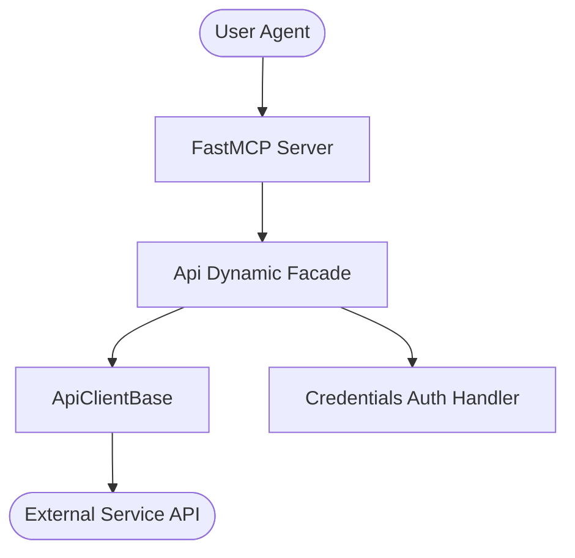

# Lgtm MCP

[](https://github.com/genius-agents/lgtm-mcp)
[](pyproject.toml)
[](LICENSE)

LGTM Stack (Alertmanager and Grafana) system observability orchestrator. Built with the highest architectural standards, incorporating dynamic facades, custom API routing, and FastMCP tool decoration.

> **Documentation** — Installation, deployment, usage across the API and MCP
> interfaces, and guidance for provisioning the LGTM observability stack are maintained
> in the [official documentation](https://knuckles-team.github.io/lgtm-mcp/).

## Table of Contents
- [Overview](#overview)
- [Features](#features)
- [Installation](#installation)
- [Usage](#usage)
- [Configuration](#configuration)
- [MCP Tools](#mcp-tools)
- [Architecture](#architecture)
- [Deployment](#deployment)
- [Documentation](#documentation)
- [Contributing](#contributing)
- [License](#license)

---

## Overview

Lgtm MCP provides a high-performance, model-optimized interface to Lgtm capabilities. It isolates the model from underlying API transport complexity, ensuring safe, idempotent, and highly traceable system interactions.

---

## Features

- **Dynamic Facade Orchestration**: Integrates multi-inheritance clients cleanly under a single facade.
- **Battle-Tested Resilience**: Out-of-the-box credential authentication, connection polling, and request retry strategies.
- **FastMCP Declarative Tools**: Fast, native schema registration with full inline validation.
- **Complete Test Intent Diversity**: Deep, automated unit, integration, and mock tests ensuring high code coverage.

---

## ⚙️ Dynamic Tool Selection & Visibility

This MCP server supports dynamic toolset selection and visibility filtering at runtime. This allows you to restrict the set of exposed tools in order to prevent blowing up the LLM's context window.

You can configure tool filtering via multiple input channels:

- **CLI Arguments:** Pass `--tools` or `--toolsets` (or their disabled counterparts `--disabled-tools` and `--disabled-toolsets`) during startup.
- **Environment Variables:** Define standard environment variables:
  - `MCP_ENABLED_TOOLS` / `MCP_DISABLED_TOOLS`
  - `MCP_ENABLED_TAGS` / `MCP_DISABLED_TAGS`
- **HTTP SSE Request Headers:** Pass custom headers during transport initialization:
  - `x-mcp-enabled-tools` / `x-mcp-disabled-tools`
  - `x-mcp-enabled-tags` / `x-mcp-disabled-tags`
- **HTTP SSE Request Query Parameters:** Append query parameters directly to your transport connection URL:
  - `?tools=tool1,tool2`
  - `?tags=tag1`

When query strings or parameters are supplied, an LLM-free **Knowledge Graph resolution layer** (using `DynamicToolOrchestrator`) matches query intents against known tool tags, names, or descriptions, with safe fallback and automated 24-hour background cache refreshing.


---

## Installation

Pick the extra that matches what you want to run:

| Extra | Installs | Use when |
|-------|----------|----------|
| `lgtm-mcp[mcp]` | Connector-focused MCP server (`agent-utilities[mcp]` — FastMCP/FastAPI + `epistemic-graph[full]`) | You only run the **MCP server** (smallest install / image) |
| `lgtm-mcp[agent]` | Agent runtime (`agent-utilities[agent-runtime,logfire]` — model orchestration + `epistemic-graph[full]`) | You run the **integrated agent** |
| `lgtm-mcp[all]` | Everything (`mcp` + `agent` + `logfire`) | Development / both surfaces |

```bash
# Connector-focused MCP server (includes the shared graph engine)
uv pip install "lgtm-mcp[mcp]"

# Agent runtime (adds model orchestration to the shared graph engine)
uv pip install "lgtm-mcp[agent]"

# Everything (development)
uv pip install "lgtm-mcp[all]"      # or: python -m pip install "lgtm-mcp[all]"
```

### Container images (`:mcp` vs `:agent`)

One multi-stage `docker/Dockerfile` builds two right-sized images, selected by `--target`:

| Image tag | Build target | Contents | Entrypoint |
|-----------|--------------|----------|------------|
| `example/lgtm-mcp:mcp` | `--target mcp` | `lgtm-mcp[mcp]` — **connector-focused**, includes `epistemic-graph[full]`; no model-orchestration stack | `lgtm-mcp` |
| `example/lgtm-mcp@sha256:<digest>` | `--target agent` (default) | `lgtm-mcp[agent]` — **agent runtime**, model orchestration + `epistemic-graph[full]` | `lgtm-agent` |

```bash
docker build --target mcp   -t example/lgtm-mcp:mcp    docker/   # connector-focused MCP server
docker build --target agent -t example/lgtm-mcp:agent-local docker/   # agent runtime
```

`docker/mcp.compose.yml` runs the connector-focused `:mcp` server; `docker/compose.yml` runs the
agent (`immutable agent digest`) with a co-located `:mcp` sidecar.

### Knowledge-graph database (`epistemic-graph`)

Both `[mcp]` and `[agent]` carry the **epistemic-graph** engine through the required
Agent Utilities core dependency (`epistemic-graph[full]`). The `[mcp]` extra keeps
the server connector-focused; `[agent]` additionally enables model orchestration. Local
deployments can use the bundled engine. For production or shared state, run
**epistemic-graph as a dedicated database service** and configure the runtime to use it.
Deployment recipes (single-node + Raft HA), connection configuration, and architecture
diagrams are documented in the
[epistemic-graph deployment guide](https://knuckles-team.github.io/epistemic-graph/deployment/).

---

## Usage

You can launch the FastMCP server in stdio mode via Python module execution:

```python
import asyncio
from lgtm_mcp.mcp_server import get_mcp_instance

async def main():
    mcp = get_mcp_instance()
    # Execute stdio loop or launch server
    print("MCP Server ready.")

if __name__ == "__main__":
    asyncio.run(main())
```

For direct shell launch, execute:

```bash
python -m lgtm_mcp.mcp_server
```

---

## Environment Variables

<!-- ENV-VARS-TABLE:START -->

#### Package environment variables

| Variable | Example | Description |
|----------|---------|-------------|
| `ALERTMANAGER_URL` | `http://localhost:9093` | Prometheus Alertmanager server API URL |
| `GRAFANA_URL` | `http://localhost:3000` | Grafana server API endpoint |
| `LGTM_TOKEN` | secret-injected | Grafana admin API Key or Service Token |
| `LGTM_MCP_BASE_URL` | `http://localhost` | Fallback base URL used when ALERTMANAGER_URL / GRAFANA_URL are unset |
| `LGTM_MCP_USERNAME` | — | Basic-auth username (alternative to LGTM_TOKEN) |
| `LGTM_MCP_PASSWORD` | secret-injected | Basic-auth password (alternative to LGTM_TOKEN) |
| `TLS_PROFILE` | `private-ca` | AgentConfig named transport profile |
| `TLS_PROFILE_REF` | `secret://transport/provider` | Direct runtime profile reference |
| `TLS_PROFILES_REF` | `secret://transport/catalog` | Named runtime profile catalog |
| `ALERTMANAGERTOOL` | `True` | These names match the authoritative "Toggle Env Var" column in the README MCP tools table (condensed action-routed surface). |
| `GRAFANATOOL` | `True` |  |

#### Inherited agent-utilities variables (apply to every connector)

| Variable | Example | Description |
|----------|---------|-------------|
| `TRANSPORT` | `stdio` | MCP transport: `stdio` \| `streamable-http` \| `sse` |
| `HOST` | `127.0.0.1` | Loopback bind host (set an authenticated ingress explicitly) |
| `PORT` | `8000` | Bind port (HTTP transports) |
| `MCP_TOOL_MODE` | `intent` | Tool surface: `intent` \| `condensed` \| `verbose` \| `both` |
| `MCP_ENABLED_TOOLS` | — | Comma-separated tool allow-list |
| `MCP_DISABLED_TOOLS` | — | Comma-separated tool deny-list |
| `MCP_ENABLED_TAGS` | — | Comma-separated tag allow-list |
| `MCP_DISABLED_TAGS` | — | Comma-separated tag deny-list |
| `EUNOMIA_TYPE` | `none` | Authorization mode: `none` \| `embedded` \| `remote` |
| `EUNOMIA_POLICY_FILE` | `mcp_policies.json` | Embedded Eunomia policy file |
| `EUNOMIA_REMOTE_URL` | — | Remote Eunomia authorization server URL |
| `ENABLE_OTEL` | `False` | Enable OpenTelemetry export |
| `OTEL_EXPORTER_OTLP_ENDPOINT` | — | OTLP collector endpoint |
| `MCP_CLIENT_AUTH` | — | Outbound MCP child auth: `oidc-client-credentials` \| `basic` \| `none` |
| `OIDC_CLIENT_ID` | — | OIDC client id (service-account auth) |
| `OIDC_CLIENT_SECRET_REF` | `secret://identity/oidc-client-secret` | Runtime secret reference for the OIDC service account |
| `MCP_BASIC_AUTH_USERNAME` | — | HTTP Basic username (`MCP_CLIENT_AUTH=basic`) |
| `MCP_BASIC_AUTH_PASSWORD_REF` | `secret://identity/mcp-basic-password` | Runtime secret reference for HTTP Basic auth (`MCP_CLIENT_AUTH=basic`) |
| `DEBUG` | `False` | Verbose logging |
| `PYTHONUNBUFFERED` | `1` | Unbuffered stdout (recommended in containers) |
| `MCP_URL` | `http://localhost:8000/mcp` | URL of the MCP server the agent connects to |
| `PROVIDER` | `openai` | LLM provider for the agent |
| `MODEL_ID` | `gpt-4o` | Model id for the agent |
| `ENABLE_WEB_UI` | `True` | Serve the AG-UI web interface |

_11 package + 24 inherited variable(s). Auto-generated from `.env.example` + the shared agent-utilities set — do not edit._
<!-- ENV-VARS-TABLE:END -->


Every variable the server reads. A local template is supplied inside
[.env.example](.env.example) — copy it to `.env` and fill in your endpoints/credentials.

### Connection & Credentials
| Variable | Description | Default |
|----------|-------------|---------|
| `ALERTMANAGER_URL` | Prometheus Alertmanager server API URL | `http://localhost:9093` |
| `GRAFANA_URL` | Grafana server API endpoint | `http://localhost:3000` |
| `LGTM_TOKEN` | Grafana admin API Key or Service Token | — |

### MCP server / transport
| Variable | Description | Default |
|----------|-------------|---------|
| `TRANSPORT` | `stdio`, `streamable-http`, or `sse` | `stdio` |
| `HOST` | Bind host (HTTP transports) | `0.0.0.0` |
| `PORT` | Bind port (HTTP transports) | `8000` |
| `MCP_TOOL_MODE` | Tool surface: `condensed`, `verbose`, or `both` | `condensed` |
| `MCP_ENABLED_TOOLS` / `MCP_DISABLED_TOOLS` | Comma-separated tool allow/deny list | — |
| `MCP_ENABLED_TAGS` / `MCP_DISABLED_TAGS` | Comma-separated tag allow/deny list | — |
| `DEBUG` | Verbose logging | `False` |
| `PYTHONUNBUFFERED` | Unbuffered stdout (recommended in containers) | `1` |

### Tool toggles
Each action-routed tool can be disabled individually via its toggle env var (set to `false`).
The full list is in the [MCP Tools](#mcp-tools) table above (`ALERTMANAGERTOOL`, `GRAFANATOOL`).

### Agent CLI (full `[agent]` runtime only)
| Variable | Description | Default |
|----------|-------------|---------|
| `MCP_URL` | URL of the MCP server the agent connects to | `http://localhost:8000/mcp` |
| `PROVIDER` | LLM provider (e.g. `openai`) | `openai` |
| `MODEL_ID` | Model id (e.g. `gpt-4o`) | `gpt-4o` |
| `ENABLE_WEB_UI` | Serve the AG-UI web interface | `True` |

---

## MCP Tools

The following declarative FastMCP tools are registered and available to upstream AI agents:

Auto-generated — do not edit between the markers below.

<!-- MCP-TOOLS-TABLE:START -->

#### Condensed action-routed tools (default — `MCP_TOOL_MODE=condensed`)

| MCP Tool | Toggle Env Var | Description |
|----------|----------------|-------------|
| `lgtm_mcp_alertmanager` | `ALERTMANAGERTOOL` | Manage LGTM MCP Alertmanager operations. |
| `lgtm_mcp_grafana` | `GRAFANATOOL` | Manage LGTM MCP Grafana operations. |

#### Verbose 1:1 API-mapped tools (`MCP_TOOL_MODE=verbose` or `both`)

<details>
<summary>14 per-operation tools — one per public API method (click to expand)</summary>

| MCP Tool | Toggle Env Var | Description |
|----------|----------------|-------------|
| `lgtm_create_alerts` | `APITOOL` | Create new Alerts (Helper method matching post_alerts). |
| `lgtm_create_dashboard` | `APITOOL` | Create dashboard. |
| `lgtm_create_silence` | `APITOOL` | Silence active alerts (Helper method for backward compatibility). |
| `lgtm_delete_silence` | `APITOOL` | Delete silence rule. |
| `lgtm_get_alert_groups` | `APITOOL` | Get a list of alert groups. |
| `lgtm_get_alerts` | `APITOOL` | Get a list of alerts. |
| `lgtm_get_dashboards` | `APITOOL` | Get Grafana dashboards. |
| `lgtm_get_receivers` | `APITOOL` | Get list of all receivers (notification integrations). |
| `lgtm_get_silence` | `APITOOL` | Get a silence by its ID. |
| `lgtm_get_silences` | `APITOOL` | Get a list of silences. |
| `lgtm_get_status` | `APITOOL` | Get current status of an Alertmanager instance and its cluster. |
| `lgtm_post_alerts` | `APITOOL` | Create new Alerts. |
| `lgtm_post_silences` | `APITOOL` | Post a new silence or update an existing one. |
| `lgtm_query_datasource` | `APITOOL` | Query a datasource. |

</details>

_2 action-routed tool(s) (default) · 14 verbose 1:1 tool(s). Each is enabled unless its `<DOMAIN>TOOL` toggle is set false; `MCP_TOOL_MODE` selects the surface (`condensed` default · `verbose` 1:1 · `both`). Auto-generated — do not edit._
<!-- MCP-TOOLS-TABLE:END -->

See [docs/overview.md](docs/overview.md) or [docs/concepts.md](docs/concepts.md) for deeper operational examples.

---

## Architecture

This package uses the standardized Agent-Utilities dynamic facade architecture:


```mermaid
graph TD
    User([User Agent]) --> Server[FastMCP Server]
    Server --> Facade[Api Dynamic Facade]
    Facade --> ClientBase[ApiClientBase]
    Facade --> Auth[Credentials Auth Handler]
    ClientBase --> Service([External Service API])
```

---

## Deployment

### Bare-Metal (Standard pip)
1. Set up your Python virtual environment (>= 3.10).
2. Install the package: `pip install .[all]`
3. Export credentials:
   ```bash
   export LGTM_URL="http://localhost:3000"
   ```
4. Run: `python -m lgtm_mcp.mcp_server`

### Container (Docker Compose)
A standard compose structure is provided inside the `docker/` folder. Build and deploy:

```bash
docker compose -f docker/compose.yml up --build -d
```

---

<!-- BEGIN GENERATED: additional-deployment-options -->
### Additional Deployment Options

`lgtm-mcp` can run as a local stdio process or container, or behind a remote
network boundary. The
[Deployment guide](https://knuckles-team.github.io/lgtm-mcp/deployment/) carries
the detailed transport contract.

- **Local container** — launch a reviewed immutable image as a least-privilege
  stdio child with no listener or published port.
- **Remote URL** — connect through an operator-supplied authenticated HTTPS
  ingress. Keep its URL, outbound identity references, trust profile, and exact
  `MCP_ALLOWED_HOSTS` in `AgentConfig`.
<!-- END GENERATED: additional-deployment-options -->

## Documentation

The complete documentation is published as the
[official documentation site](https://knuckles-team.github.io/lgtm-mcp/) and is the
recommended reference for installation, deployment, and day-to-day operation.

| Page | Contents |
|---|---|
| [Installation](https://knuckles-team.github.io/lgtm-mcp/installation/) | pip, source, extras, prebuilt Docker image |
| [Deployment](https://knuckles-team.github.io/lgtm-mcp/deployment/) | run the MCP server, the agent server, Compose, Caddy + Technitium, env config |
| [Usage](https://knuckles-team.github.io/lgtm-mcp/usage/) | the MCP tools and the `Api` Python client |
| [Backing Platform](https://knuckles-team.github.io/lgtm-mcp/platform/) | deploy the LGTM observability stack with Docker |
| [Overview](https://knuckles-team.github.io/lgtm-mcp/overview/) | architecture and the dynamic facade |
| [Concepts](https://knuckles-team.github.io/lgtm-mcp/concepts/) | concept registry (`CONCEPT:LGTM-*`) |

---

## Contributing

Please audit all code changes against the repository's contribution and review requirements, and run:

```bash
pre-commit run --all-files
```

---

## License

This project is licensed under the MIT License. See the [LICENSE](LICENSE) file for complete details.


<!-- BEGIN agent-utilities-deployment (generated; do not edit between markers) -->

## Deploy with `agent-utilities-deployment`

Provision this package with the consolidated **`agent-utilities-deployment`**
workflow. It selects an installed-package, editable-source, or immutable-container
path; records only runtime secret and TLS-profile references in `AgentConfig`; and
runs doctor, registration, policy, observability, and rollback gates. Ask your agent
to **"deploy `lgtm-mcp` with agent-utilities-deployment"**.

| Install mode | Command |
|------|---------|
| Installed package | `uv tool install "lgtm-mcp[mcp]"`, then run `lgtm-mcp` |
| Editable source | `uv pip install -e ".[agent]"`, then run `lgtm-mcp` |
| Immutable container | deploy `registry.example.invalid/lgtm-mcp@sha256:<digest>` through the operator-selected orchestrator |

The repository embeds no deployment profile, credential value, certificate path, or
environment-specific endpoint. Supply those at runtime through `AgentConfig` and the
configured secret provider.

<!-- END agent-utilities-deployment -->

<!-- GOVERNED-CAPABILITY:START -->
## Governed capability contract

This package ships a compact canonical skill surface with specialist procedures
kept as referenced workflows. The current MCP tools, skill metadata,
`connector_manifest.yml`, ontology, mappings, shapes, fixtures, migrations,
tool-schema fingerprints, and certification metadata form one versioned
capability contract. Validate them together; do not rely on stale tool names or
historical per-task skill wrappers.

Runtime endpoints, credentials, certificate trust, tenant identity, retention,
and observability policy are deployment inputs and are never packaged values.
See [Configuration, trust, and privacy](docs/configuration.md) before enabling a
network transport, connector ingestion, GraphOS delegation, or trace export.
<!-- GOVERNED-CAPABILITY:END -->
